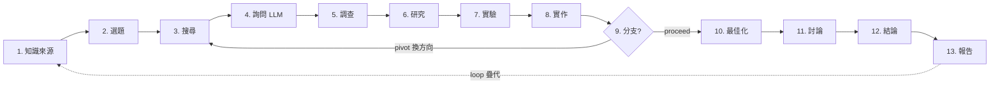
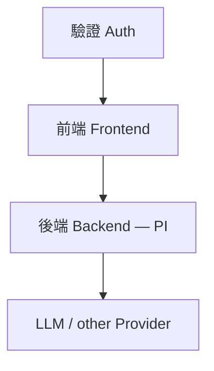

# Auto-Research — 全自動研究系統 (Spark 討論)

> ⚠️ **已棄用（2026-08-15）**：本文件為早期 Spark 階段的討論紀錄，已由 [index.md](../index.md) + [reference/](../reference/) + [features/](../features/) 取代。
> 僅保留作為歷史脈絡參考。設計以 drill-docs 其他文件為準。

> **North Star**: 打造一個全自動研究平台。整合知識來源 → 選題 → 搜尋 → 調查 → 實驗 → 報告的完整 pipeline，每個階段皆可 loop 直到完善。

---

## 1. 模型層 (Models)

| 項目 | 內容 |
|---|---|
| 主力模型 | DeepSeek v4 flash 0731 (量化版本) |
| Ref | https://gist.github.com/G36maid/8c1187039a8388c5bc4eb4fd3fc781df |

> LLM / Provider 抽象層已由 PI 完成，後續平台直接複用。

---

## 2. 設計理念

### 2.1 核心策略 —「蒸餾」

```
調查所有人的研究方式  →  抽象出共同模式  →  沉澱為 workflow 模板與 agent 行為
```

不只是問大家「怎麼研究」，而是把每個人滿意的工具、不滿意的**痛點**、時間軸上的完整流程，全部拆解後重組成可執行的 pipeline。

### 2.2 研究生命週期 Pipeline

完整研究流程的 13 個階段，每階段獨立可 loop、可分支、可回溯:

| # | 階段 | 說明 |
|---|---|---|
| 1 | 知識來源 | 資料收集、訂閱、索引 |
| 2 | 選題 | 主題過濾、排序、聚焦 |
| 3 | 搜尋 | 多源搜尋、最大化覆蓋 |
| 4 | 詢問 LLM | 問題拆解、深度問答 |
| 5 | 調查 | 交叉驗證、事實查核 |
| 6 | 研究 | 系統性整理、關聯建立 |
| 7 | 實驗 | 假設驗證、A/B 對照 |
| 8 | 實作 | PoC、原型、程式碼 |
| 9 | 換方向 / 分支 | 失敗重啟、平行探索 |
| 10 | 最佳化 | 參數調校、流程改善 |
| 11 | 討論 | 多 agent 辯論、peer review |
| 12 | 結論 | 綜合判斷、信心評分 |
| 13 | 報告 | 圖表、LaTeX、PDF 輸出 |



---

## 3. Agent 設計

### 3.1 參考系統

| 系統 | 角色 | 連結 |
|---|---|---|
| **PI agent** | 後端核心，LLM/provider 抽象已完成 | https://pi.dev/ |
| HERMES agent | Agent 範式與記憶參考 | https://hermes-agent.nousresearch.com/ |
| NotebookLM | 知識庫形態參考 | — |
| Claude / Codex / OpenCode / oh-my-pi | 編碼與研究 agent 範式 | — |
| n8n | Workflow 引擎參考 | — |

### 3.2 Minimal Agent 規格

- **核心工具**: `read` / `write` / `edit` / `bash`
- **知識來源**: `AGENTS.md`
- **擴充機制**: 任何工具、配置、Hook、MCP、Skills 皆透過**插件**接入

https://odysseusai.dev/
https://github.com/odysseus-dev/odysseus
https://youtu.be/rAzT5lcezPs?si=4SWmn4v167m6WPjl




fork chat (graph)

mini n8n ()


---

## 4. 產品設計

### 4.1 前端模式 (Modes)

依研究 pipeline 階段切換對應模式，每個模式提供專屬工具組與 UI:

```
知識來源 / 選題 / 搜尋 / 詢問LLM / 調查 / 研究 / 實驗 / 實作 /
換方向與分支 / 最佳化 / 討論 / 結論 / 報告
```

### 4.2 工具整合對照

| 功能分類 | 候選工具 |
|---|---|
| 最大化搜尋 | Gemini DeepResearch / Perplexity |
| 知識庫 | NotebookLM / Obsidian |
| 用戶記憶 | Claude / HERMES / Gemini / GPT |
| Agent mode | OpenClaw / HERMES / others |
| 排程任務 | Cron job — 每天「幫我 XXX」 |

### 4.3 Workflow 預設模板

預先配置數條 workflow，讓 agent 照表操課 (pre-configure):

| 模板 | 內容 |
|---|---|
| **調查** (Investigation) | 多源搜集 → 交叉驗證 → 摘要 |
| **論文復現** (Paper Reproduction) | 讀 paper → 重現實驗 → 對比 |
| **PoC** (Proof of Concept) | 假設 → 最小實作 → 驗證 |
| **圖表 → 總結 → 報告** | 資料 → 視覺化 → 撰寫 |
| **Review → Refine** | 評審 → 改善迴圈 |
| **Init** | 初始化新研究專案 |

### 4.4 編輯器

- Markdown / PDF / 各式 viewer
- **LaTeX editor + viewer** (內建模板)

---

## 5. 系統架構

### 5.1 分層職責

1. **LLM / Provider 層** — PI 已完成 (模型抽象、路由、量化)
2. **後端層 (PI)** — orchestration、workflow engine、cron、memory、knowledge base
3. **前端層** — modes UI、editor、viewer
4. **驗證層 (Auth)** — 身分驗證與權限控管

### 5.2 架構圖



### session 管理

## 用戶隔離

## 沙盒

## storage

## system status

## 取名

drill ?

giga drill break
